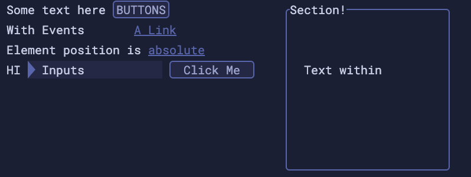
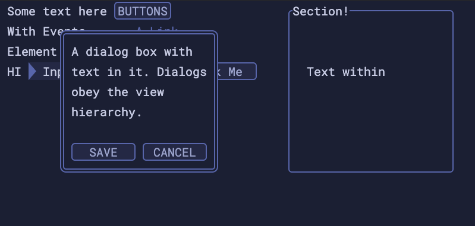

# Elee components

This is a [Svelte](https://svelte.dev) project I used to learn that library, create basic UI elements, and play around with high-performance UI rendering and interaction. This was also an experiment in creating a UI library that adhered to an absolute grid for positioning and that could possibly be scripted such that the UI structure would be streamed from the server and the lightweight UI library would render the UI as the data for it arrived.

Inspired by text-based interfaces with fast keyboard navigation and rendering.





To run yourself: clone the repo and

```bash
cd front/
npm install
npm run dev
go to http://localhost:5000
```

This was built with Sapper, which is no longer supported.